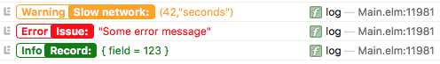

# elm-logger

This package provides a generic logger with log levels. Logs will only be
printed if the log level matches or exceeds the minimum log level in the
Configuration. Log are also displayed colored according to their level in the
browser's console.



The package's concept is that some other module in the implementation scope of
the app implements convenience functions wrapping a Config and Levels into
single functions. See the following template for an example:

    module MyUtils

    import Logger

    loggerConfig : Logger.Config
    loggerConfig =
        Logger.config Logger.Info

    log : String -> a -> a
    log =
        Logger.log loggerConfig Logger.Debug

    logVerbose : String -> a -> a
    logVerbose =
        Logger.log loggerConfig Logger.Verbose

The value `loggerConfig` should be created using `Logger.config` with the
minimum log level. By changing the minimum log level in a central module you can
silence any logs in code that fall below that level. The above template
implementation allows you to replace calls to `Debug.log` with `MyUtils.log`.

Please have a look at the example app.

## Installation

This package requires native modules. For this reason it is currently not
available as a community package.

In order to use in your app you should:

* Copy it to your src folder or include it as a git submodule.
* Or use a tool such as [elm-github-install](https://github.com/gdotdesign/elm-github-install)


Please make sure to enable native-modules in your Elm app by including the
following value in your `elm-package.json`:

```json
    "native-modules": true,
```

When adding this package as a submodule or when copying the files, please make
sure to include `"path-to-elm-logger/src"` in the list of `"source-directories"`
in your `elm-package.json` file.
